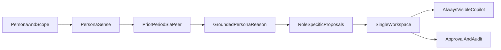

# Mobility Pulse — Transport Operations Agent

Persona-selectable workspace for the *Agentic Intelligence & Reporting Layer for Enterprise Mobility* brief: **Sense → Reason → Act**, with benchmarks and an always-visible copilot.

The app loads only the anonymised CSVs already in `data/` into DuckDB. Communications are approval-gated simulations. There is no live GPS, vendor API, budget file, named employee roster, or true emissions inventory.

**Personas** (each one is its own sidebar menu entry under *Personas*):

| Persona | Default horizon | Pulse | Copilot |
|---|---|---|---|
| Transport manager | 7 days | Vendor OTA, delays, safety, SLA/peer/prior | Vendor/trip/alert investigation |
| Transport & facilities head | 30 days | Billed spend, cost/km, vendor scorecard, electric-trip share (proxy) | Operating story and billing/SLA |
| Team / line manager | 1 day | Office+shift readiness (boarded, late pickup, no-show), masked riders | Readiness and follow-up only |

“My team” means the selected **office and shift**. The files have no manager–employee hierarchy. Riders appear as `Rider-A7F2`, never raw `stwid`. Demo walkthrough: [`docs/demo-script.md`](docs/demo-script.md).

## PDF requirement mapping

| Requirement | Where it lives |
|---|---|
| Sense / Reason / Act | DuckDB analytics → grounded Reason → `action_policy` |
| Benchmarks (prior, peer, SLA) | `core/sense/benchmarks.py`; missing samples are caveats |
| Three personas | Sidebar pages in [`app/streamlit_app.py`](app/streamlit_app.py); defaults in `core/models/persona.py` |
| Persistent chatbot | Right-hand Copilot; DuckDB checkpoints per persona |
| Approval-gated actions | Workspace + Advanced → Actions & Audit |
| Leadership output | Facilities-head Markdown/HTML brief (browser print, no PDF library) |

Honest gaps: no budget vs actual; no named people or contact details; electric-trip share is not CO₂e. Historical `alerts_data.csv` is not a live feed.

## Architecture



Sense never calls an LLM. Reason receives only structured issue evidence — never raw CSV rows, employee IDs, or unaggregated records. Act applies a fixed policy; “automatic email” means generate and mark a simulated draft, not SMTP/Gmail/Teams.

## One-row-per-trip grain

`ride_data_trip` is the trip spine (one row per trip). Employee, billing, alert, and feedback files are one-to-many.

Correct join path: clean each source → aggregate children to one row per `trip_id` → left-join those aggregates onto cleaned trips → `mobility_trip_360`.

Invariant (hard fail if broken):

```text
COUNT(*) FROM mobility_trip_360
    == COUNT(DISTINCT trip_id) FROM ride_trips_clean
```

The three monthly ride files can repeat the same `trip_id`. Bootstrap keeps one row per `trip_id` (latest `trip_date`) and records how many extra rows were collapsed.

## Data files

Place CSVs (or symlinks to them) in `data/`:

- `emp_data.csv` (source file may be named `emp_Data.csv`)
- `bill_data.csv`
- `alerts_data.csv`
- `Ride_data _trip-*.csv` (May / June / July discovered by glob, not a single hardcoded month)
- `trip_feedback.csv`

No file-upload UI.

## Setup

```bash
python -m venv .venv
source .venv/bin/activate
pip install -r requirements.txt
streamlit run app/streamlit_app.py
```

Bootstrap verification (no UI required):

```bash
PYTHONPATH=. python -m core.bootstrap.app_context
```

## Environment variables

Copy `.env.example` to `.env`. Reason reads only these, and `core/reason/llm_provider.py` is the single place an LLM is constructed:

| Variable | Purpose |
|---|---|
| `LLM_PROVIDER` | `ollama` (default) or `openai` |
| `LLM_MODEL` | e.g. `qwen:14b` |
| `OLLAMA_BASE_URL` | defaults to `http://localhost:11434` |
| `OPENAI_API_KEY` | only when `LLM_PROVIDER=openai` |

Default local setup:

```bash
ollama pull qwen:14b
ollama serve
```

Structured output is enforced with Ollama's JSON-schema constrained decoding, so the model must return a valid `IssueReasoningOutput`. If the provider is unreachable, the model misbehaves, or validation fails, Reason falls back to deterministic templates and the UI labels which path produced each explanation. Raw trip rows and employee identifiers are never sent to the model.

Reasoning is the slow step on a local model — roughly 10–15 seconds per issue. `app.max_issues_for_reasoning` in `config/settings.yaml` is 2. Persona pulse explanations are cached per persona and scope.

## Workspace

One sidebar page per persona (transport, facilities, line manager). Switching pages switches pulse, default horizon, actions, and copilot thread. Advanced destinations keep Actions & Audit and Data Health.

Each persona page: **Pulse** (KPIs + exception cards) → **ranked vendors or masked roster** with click-through drill → **Evidence** → **Next Actions**. Copilot stays on the right and inherits a vendor selected on the canvas.

Pulse cards: what happened → compared with what → why it matters → what to do now.

Sample copilot prompts:

- Transport: “What needs attention in the last 7 days?” then inspect the worst vendor on the table.
- Facilities: “Give me a 30-day operating story for leadership.”
- Line manager: “Who boarded, no-showed or had a late pickup on this shift?”

Delay reasons are recorded signals, never proven causes, and the source writes `NODELAY` when it captured no reason at all. That sentinel is reported as **NOT RECORDED** and is never ranked as a cause, so "most late trips have no recorded reason" is stated plainly instead of being disguised as an explanation.

Sense detects configured punctuality breaches (overall/vendor/office/shift), critical safety events, and billing anomalies. A historical benchmark is the immediately preceding window with the same inclusive length—not all earlier data. Peer OTA is a current-period median with rank and sample count. Comparisons below their configured minimum sample are marked unavailable rather than used in reasoning.

### Copilot safety model

The model is never a database agent. It cannot generate arbitrary SQL, mutate DuckDB, or return raw `stwid`. Line-manager roster tools mask before the result is stored or sent to the model. Each question runs a bounded graph:

1. **Route.** Explicit wording is classified by deterministic rules. Persona allowed-tool lists clamp anything off-policy. The LLM is consulted only for questions the rules cannot classify. Precedence is fixed: a vendor or period named in the question beats the workspace filters, which in turn beat anything inherited from the conversation, so a stale subject can never silently narrow a report. A question that ranks vendors drops any single-vendor filter, because a ranking of one is not a ranking.
2. **Plan.** The route becomes a visible typed plan. No step can contain generated SQL.
3. **Gather.** Application code runs fixed parameterized SQL and computes verified summaries. Every summary states the scope it was measured over, so a fleet-wide number can never be read as one vendor's.
4. **Answer.** The LLM writes the reply from the question plus those verified rows, with no conversation history, so it cannot carry a finding over from an earlier turn. When the manager asks to email, call, assign or escalate, the reply is written deterministically from the approval-gated draft instead: the model never writes the message, invents a recipient, or claims anything was sent.

Persona threads (`transport_manager-copilot`, `facilities_head-copilot`, `line_manager-copilot`) keep follow-up context across restart. Conversation checkpoints, manager actions and enriched audit events are written to `.mobility_pulse/chat_memory.duckdb` by a DuckDB implementation of LangGraph's `BaseCheckpointSaver`. The published `langgraph-checkpoint-duckdb` package is not used because it pins an incompatible `langgraph-checkpoint`. Nothing invokes arbitrary code or an external service.

## Automatic action booleans (`config/settings.yaml`)

- `auto_create_manager_alerts`: create an in-app manager alert for high/critical issues.
- `auto_create_email_drafts`: create an email **draft** for eligible vendor/safety issues (not a real send).
- `auto_mark_approved_actions_simulated_sent`: if true, an approved draft can move to `SIMULATED_SENT` automatically; if false, it stays `APPROVED` until the manager presses Simulate Send.

Every simulated execution requires approval. Email drafts finish as `SIMULATED_SENT`; other actions finish as `SIMULATED_COMPLETED`.

## Tests

```bash
PYTHONPATH=. pytest tests/ -q
```

Tests do not require LLM credentials.

## Extensibility

Streamlit can be replaced by FastAPI + React/Next.js without rewriting ingestion, DuckDB analytics, the LangGraph workflow, or the central LLM provider.
